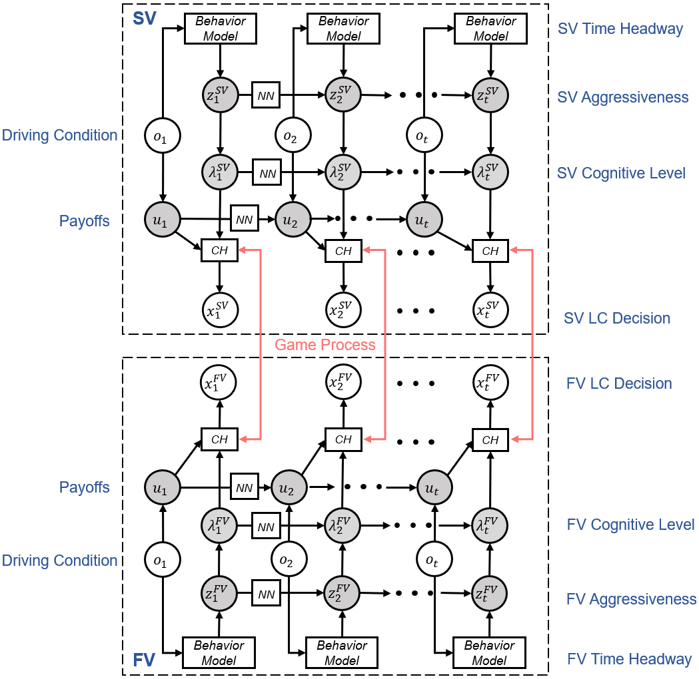
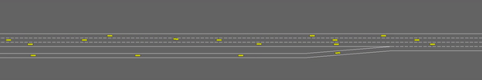

# DMCHM
 This repository includes codes of the paper named **Combining Time Dependency and Behavioral Game: A Deep Markov Cognitive Hierarchy Model for Human-Like Discretionary Lane Changing Modeling**. In the paper, we propose a novel model, called Deep Markov Cognitive Hierarchy Model (DMCHM) which combines time dependency and behavioral game interaction for discretionary lane-changing modeling. Specifically, the lane-changing interaction process between the subject vehicle and the following vehicle in the target lane is modeled as a two-player game. We then introduce three dynamic latent variables for interaction aggressiveness, cognitive level, and payoffs based on the Hidden Markov Model.

## Model Overview




## Model Training

First install requirements

```shell
pip install -r requirements.txt
```

Then you can train the model with sample dataset:

```shell
python main.py
```

The trained model will be named as *best_model.pth*.


## Simulation

We also provide simulation environment based on [Highway-Env](https://github.com/Farama-Foundation/HighwayEnv). Please note that we implement the simulation in a merging scenario, and several environmental files are changed. Hence, the users should establish or place the original files under *./site-packages/highway_env/*. Specifically,

- road.py -> ./highway_env/road/road.py
- kinematics.py -> ./highway_env/vehicle/kinematics.py
- behavior.py -> ./highway_env/vehicle/behavior.py
- controller.py -> ./highway_env/vehicle/controller.py
- merge_env.py -> ./highway_env/envs/merge_env.py

Afterwards, the *scaler.pkl* and *best_model.pth* should be put under the simulation path in order to use our DMCHM. For more details related to Highway-Env, please check their official documents. 

Here is a sample simulation, we can observe many discretionary lane-changing maneuvers:




## Citation

